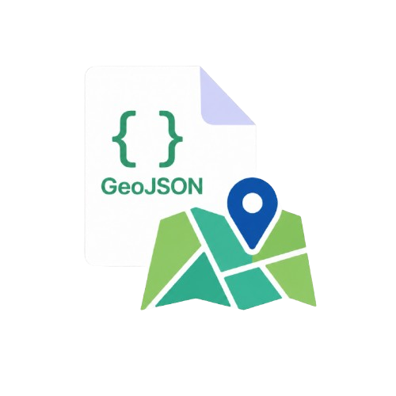

# Maps Viewer

> A VS Code extension that visualizes, compares, groups, scopes, and inspects one or many GeoJSON files on an interactive Mapbox map — without ever leaving your IDE.

Right-click any `.geojson` file → **View in Maps** → see it on a real map with hover popups, grouped layers, country view, primary-key records, feature zoom, optional point rendering, and saved Map Projects.



> **Status**: v0.1.4 (alpha — first public release candidate). Built across 5 phases from spec to ship; see `.claude/PRPs/` for the full PRD, plans, and per-phase implementation reports.

---

## Features

- **Right-click GeoJSON → View in Maps** — instant in-IDE map, no upload to external tools
- **Multi-file comparison** — load several files into one map, group them, share colors and visibility
- **Groups** — create groups, drag profiles in/out, apply shared group color, and restore profiles when groups are deleted
- **22-color palette** — auto-cycles per layer; pick any swatch with one click
- **Hover-to-highlight + properties popup** — every feature reveals its full attribute set
- **Standard / Satellite basemap toggle** — top-right of the map
- **Maps Manager sidebar** — save your current map as a named project; reopen it later with identical layers + camera
- **Primary key records** — select a property per layer, search/sort records, hide/show individual records, and zoom to a single feature
- **Zoom onto features** — fly directly to a selected geometry from records or the command palette
- **Editor-to-map zoom** — click inside a `.geojson` feature record in the editor to zoom the open map to that feature
- **Coordinate tools** — inspect feature coordinates, right-click map points, open OSM/GraphHopper links, and query OSM at a point
- **Country View** — pick from curated countries to fit and constrain the map to that region
- **Point Render** — optionally collapse lines/shapes into fixed-size dots only when they become too small at the current zoom
- **Adjustable stroke width** — 0–30 per layer, live preview as you drag
- **Bundled Mapbox access** — opens maps immediately with the extension's public token; advanced users can override it with their own token

## Quickstart

```
1. Install the extension
2. Open a folder containing one or more `.geojson` files
3. Right-click a .geojson → "View in Maps"
4. The map opens in a panel beside the editor
```

See [docs/quickstart.md](docs/quickstart.md) for the full walkthrough including multi-file load, grouping, country view, primary-key records, point rendering, and saving projects.

## Maps Manager

Click the **Maps Manager** icon in the activity bar to see Recent + All Projects.

- **Save as Project…** captures: file paths + layer state (colors, stroke, visibility, names, groups) + current camera + basemap + country + primary-key map.
- **Open** any project to restore the exact view.
- **Inline actions** on hover: Open · Rename · Delete.
- **Missing files** prompt a per-file "Locate…" picker — relocate and the project is updated for next time.

By default, projects are stored in VS Code's per-extension global storage. Set `mapsViewer.mapsLocation` to a path in iCloud / Dropbox to sync across machines.

## Discovery commands (palette)

| Command | What it does |
|---|---|
| `Maps Viewer: View in Maps` | Open a `.geojson` (right-click is the usual entry) |
| `Maps Viewer: Add File to Current Map…` | Append more layers to the active panel |
| `Maps Viewer: Set Primary Key…` | Pick a layer + a property to use as the layer's record id |
| `Maps Viewer: Locate Feature…` | Flat quick-pick of every PK value; jumps + pulses the feature |
| `Maps Viewer: Set Country Scope…` | Country quick-pick; map auto-fits |
| `Maps Viewer: Save as Project…` | Persist the current map as a named project |
| `Maps Viewer: Set Mapbox Token…` | Override the bundled token with your own Mapbox public token |

## Settings

| Setting | Default | Purpose |
|---|---|---|
| `mapsViewer.defaultBasemap` | `standard` | Basemap shown when a map first opens. `standard` or `satellite`. |
| `mapsViewer.mapsLocation` | (empty) | Absolute path to a custom `maps.json`. Use to point at iCloud / Dropbox for cross-machine sync. Empty = VS Code global storage. |

## Privacy

Maps Viewer **does not collect telemetry**. The extension includes a Mapbox public token for basemap requests; if you override it, your token is stored locally via VS Code's `SecretStorage`. Your GeoJSON files never leave your machine. See [docs/privacy.md](docs/privacy.md) for the full statement.

## Known limitations

- **50 MB hard cap** on a single `.geojson` file (read into memory; large datasets show a parse error)
- **Concurrent edits** to `maps.json` from multiple VS Code windows are last-writer-wins
- **47 curated country bboxes** — easy to add more via a PR to `packages/core/src/bbox/country-bboxes.json`
- **Dev mode F5** vs **VSIX install** — they're identical at runtime; sibling-package URIs are bundled into the VSIX's `dist/webview/` at build time
- **macOS users**: VS Code's F5 may collide with macOS Dictation. Use `Cmd+Shift+P → Debug: Start Debugging` instead

## Dev setup (for contributing)

```bash
git clone https://github.com/WanqingXia/maps-viewer.git
cd maps-viewer
pnpm install
pnpm build
# F5 in VS Code (or Cmd+Shift+P → "Debug: Start Debugging")
# A second VS Code window launches with the extension installed
```

Tests:

```bash
pnpm test          # 77 tests across 11 files
pnpm typecheck     # 4 packages, strict
```

Package + install locally:

```bash
pnpm build
pnpm --filter maps-viewer run package
code --install-extension packages/vscode/maps-viewer-0.1.4.vsix --force
```

See `.claude/PRPs/` for:
- `prds/maps-viewer.prd.md` — the source-of-truth product spec
- `plans/completed/*.plan.md` — per-phase implementation plans
- `reports/*.md` — what was actually built per phase

## License

MIT — see [LICENSE](./LICENSE).
